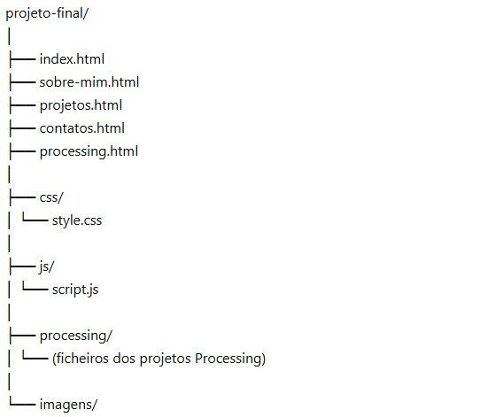

# projeto-final-raquel-mendes
Projeto Final da UC - Laboratório de Projeto II

## Descrição
O projeto final tem como objetivo a criação de um portfólio, tendo como base os trabalhos desenvolvidos ao longo da licenciatura.

Os trabalhos desenvolvidos na linguagem **Processing** devem estar organizados na página `processing.html`, sendo apresentados nos respetivos **canvas**.

As páginas `index.html`, `sobre-mim.html`, `projetos.html` e `contactos.html` são de conteúdo livre, sendo definidas pelos autores do projeto.

---

## Objetivos
- Desenvolver um website pessoal (portfólio);
- Organizar e apresentar trabalhos académicos;
- Aplicar conhecimentos de HTML, CSS e JavaScript;
- Integrar projetos desenvolvidos em Processing.

## Tecnologias Utilizadas
- HTML5  
- CSS3  
- JavaScript  
- Adobe Illustrator
- Adobe Photoshop
- Figma
- Processing  

---

## Páginas do Website

- **index.html** → Página inicial - Apresentação e destaques
- **sobre-mim.html** → Informação sobre o autor - Percurso, interesses e motivações
- **projetos.html** → Apresentação dos trabalhos desenvolvidos com subcategorias  
- **processing.html** → Projetos interativos desenvolvidos em Processing (com canvas)
- **contactos.html** → Contactos e redes sociais

---

## Categorias de Projetos

- **UI/UX & Prototipagem** — Trabalhos desenvolvidos em Figma
- **Identidade Visual** — logótipos, sistemas de identidade
- **Design Gráfico** — Photoshop e Illustrator (ilustração, composição, etc.)

---

## Estrutura do Projeto

## Autor
- Raquel Mendes

## Ano Letivo
- 2025/2026

## Unidade Curricular
- Laboratório de Projeto II